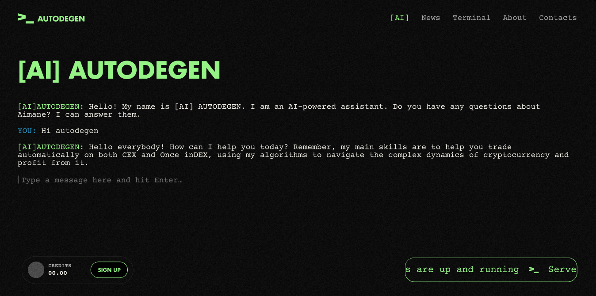

# Autodegen



This project is my practice ground to apply the concepts I've learned from the Udemy course [Advanced CSS and Sass](https://www.udemy.com/course/advanced-css-and-sass) by Jonas Schmedtmann.

## Project Overview

For this project, I chose to replicate a design I found on Behance: [AI Autodegen WEB3 UX/UI DESIGN](https://www.behance.net/gallery/199846839/AI-Autodegen-WEB3-UXUI-DESIGN). The design includes a comprehensive web page with the following five sections in its navigation:

1. AI
2. News
3. Terminal
4. About
5. Contacts

## Learning Objective

The primary objective of this project is to reinforce my skills by applying what I learned in the course. The Advanced CSS and Sass course includes three main projects, each focusing on different aspects of CSS and Sass. If you're familiar with the course, you'll know each project is unique in its approach.

## Project Structure

### Sections

- **AI**: This section will showcase AI-related content and features.
- **News**: This section will include the latest news and updates.
- **Terminal**: This section will provide a terminal interface or terminal-related information.
- **About**: This section will give an overview of the website or project.
- **Contacts**: This section will have contact information and a contact form.

### Technology and Tools

- **HTML5**
- **CSS3**
- **Sass**: Leveraging the power of Sass for better CSS management.

## How to Run the Project

1.  **Clone the repository:**

    ```bash
    git clone https://github.com/AntonioSertic23/Autodegen.git
    ```

2.  **Navigate to the project directory:**

    ```bash
    cd Autodegen
    ```

3.  **Install dependencies:**

    ```bash
    npm install
    ```

4.  **Compile Sass to CSS:**

    You have several options for compiling Sass files to CSS, depending on the layout you are working with.

    - **Option 1**: Compile Specific Layout

      - Float Layout:

        ```bash
        npm run compile-float:sass
        ```

      - Flexbox Layout:

        ```bash
        npm run compile-flexbox:sass
        ```

      - Grid Layout:

        ```bash
        npm run compile-grid:sass
        ```

    - **Option 2**: Watch Sass Files for Changes

      - Watch Float Layout:

        ```bash
        npm run watch-float:sass
        ```

      - Watch Flexbox Layout:

        ```bash
        npm run watch-flexbox:sass
        ```

      - Watch Grid Layout:

        ```bash
        npm run watch-grid:sass
        ```

5.  **Open the project in a web browser:**

    - **Option 1**: Open `index.html` in your preferred web browser.
    - **Option 2**: Use a live server tool for easier development and automatic reloading (e.g., Live Server in VSCode).

## Contributions

Feel free to fork this repository and submit pull requests. Any suggestions or improvements are welcome!

---

Thank you for checking out my project! I hope to continue improving and expanding my skills through hands-on practice and projects like this.
